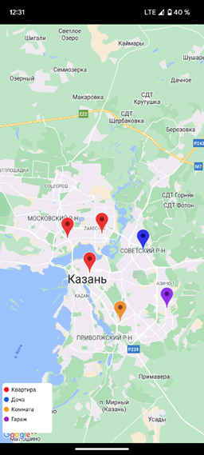

# Tenant

Приложение, облегчающий процесс управления объектами недвижимости, предоставляя возможность их мониторинга, 
который включает в себя просмотр текущего состояния объекта, 
просмотр и добавления данных объекта недвижимости и арендатора, отправки уведомлений о дне оплаты и окончания договора
прием платежей и возможность отслеживания доходов от аренды и расходов на эксплуатацию.

При открытии приложения будет отображаться экран со списком объектов недвижимостей, если они добавлены.

При нажатии на всплывающую кнопку открывается экран добавления объекта недвижимости.

При нажатии на последную кнопку нижней навигации открывается список уведомлений

При переключении на режим карты открывается экран карты с маркерами, 
которые показывают объекты недвижимости. 
Маркеры являются разноцветными и каждый цвет отвечает за определенный вид объекта.

При нажатии на элемент списка объектов открывается экран данных договора и арендатора, если они есть. 

А также экран списка эксплуатаций.

